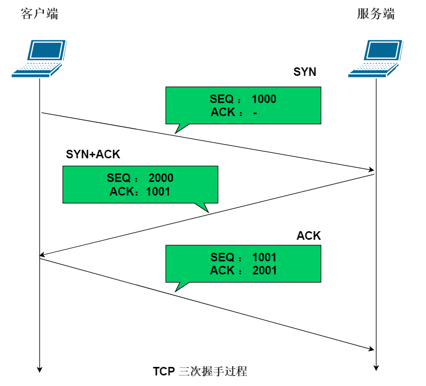
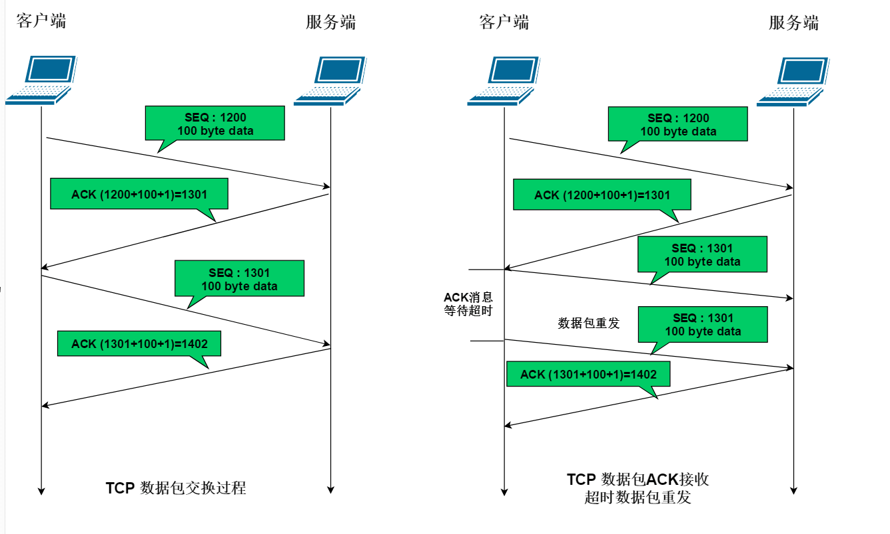
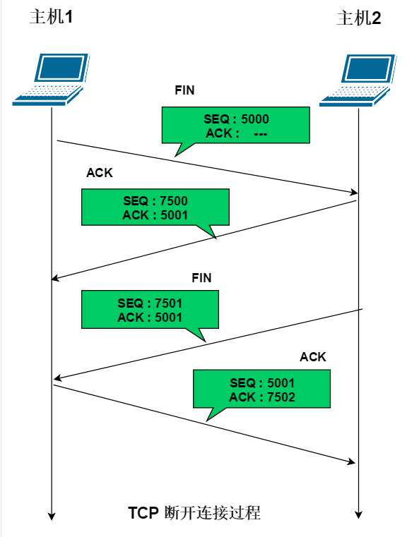

# TCP协议概述
---
+ 全称为传输控制协议，是Transmission Control Protocol的简写
+ TCP 协议在实际传输过程中添加了关于数据的接收反馈及数据校验等等操作来确保网络数据传输过程中的稳定可靠。
---
# TCP 数据传输过程
---
+ 与 UDP 传输方式最大的不同，TCP 传输方式需要建立连接，除此之外，还有对数据包传输的顺序要求（既对每次接受到的数据都有顺序要求，顺序不对会向对方发出正确序号数据包的接收请求，确保数据不丢失）
+ TCP建立连接：
+ 
+ TCP数据传输：
+ 
+ TCP断开连接:
+ 
---
# C++基本项目结构
---
+ 源代码文件目录（src)
+ 头文件目录（include)
+ 工具文件目录（tools)
+ 实例程序文件目录（test)
+ 项目构建文件（Makefile)

+ 创建项目的流程：构建项目目录-》根据基本结构创建对应的目录-》创建main.cpp主文件-》创建头文件-》创建 Makefile 文件
---
# Socket
---
+ 在C++中提供了Socket套接字去实现UDP通信，Socket套接字将UDP协议的具体内容封装起来，对外提供接口
+ 只需要调用这些接口，就能间接的调用UDP协议，从而封装要传输的数据，然后从应用层扔到传输层
